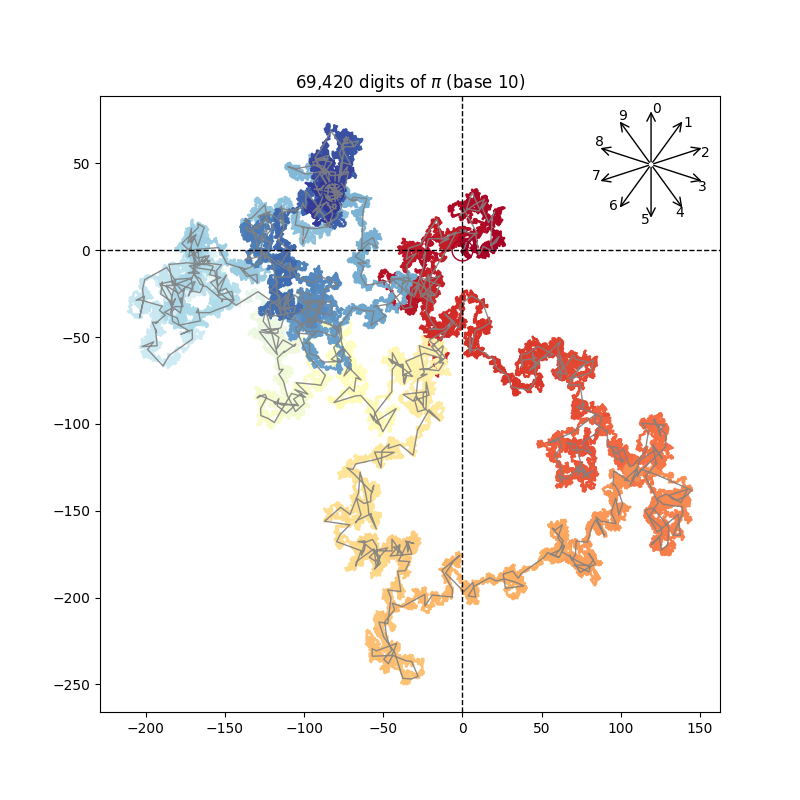

# Digit explorer
If each digit was representing a unit step in a given direction, what trajectory would be drawn by reading the digits of a mathematical constant one after the other?

This tool allows to vizualise such trajectories: choose a constant, a number of digits and even the numerical base to express it, and admire the random path it generates.



## How to use the tool?
1. Go to the root directory
2. Run ```pip install -r requirements.txt``` to install the required packages
3. Run ```python digit_explorer.py``` for a demonstration (check the ```out/``` folder!)
4. Run ```python digit_explorer.py --help``` to see how to choose the parameters

## Nice plot, but what am I looking at?
You start at the <span style="color:darkred">reddest</span> coordinates (0,0). Then each digit moves you by 1 unit in its assigned direction, which is indicated by the compass (0 is always north). For instance, for &pi; = 3.14159..., you will first move north-east (1), then south-east (4), then north-east (1), then south (5), then north-west (9), and so on. The last point is plotted in <span style="color:deepskyblue">dark blue</span>.

Note than the slightest change in base (say base 16 vs base 17) radically changes the overall path. Some paths evolves around (0,0), other may drift away quickly.

## Why did you do that?
I was inspired by François Morellet's "Pi piquant de façade - 1=12°", where the digits of &pi; control the angles between pairs of adjacent neons (starting from the right).


